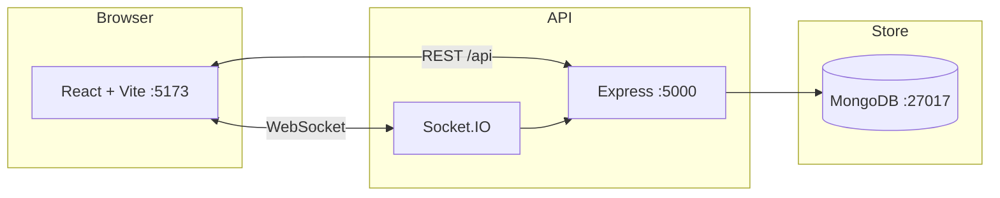

<div align="center">

# OfficeBite

**Corporate food delivery** — order lunch to your desk with real-time tracking, secure checkout, and smooth animations.

[](https://react.dev)
[](https://nodejs.org)
[](https://www.mongodb.com)
[](https://www.typescriptlang.org)


[Features](#features) · [Quick start](#quick-start) · [API](#api-overview) · [Deploy](#deployment) · [Docs](#related-documentation)

</div>

---

## Overview

OfficeBite is a **full-stack MERN application** built for office employees during peak lunch hours (12:00–2:30 PM). It combines a premium React UI (Framer Motion, Tailwind CSS v4) with an Express API, MongoDB, Socket.IO live updates, and Stripe payments (including a **demo mode** when keys are not configured).

| | |
|:---|:---|
| **Frontend** | React 19 · TypeScript · Vite · Zustand · React Router 7 |
| **Backend** | Express · JWT cookies · Mongoose · Socket.IO · Nodemailer |
| **Ops** | Docker Compose · GitHub Actions CI |

---

## Features

<details>
<summary><strong>User experience</strong></summary>

| Area | What you get |
|:---|:---|
| **Home** | Hero, featured restaurants, popular dishes, office lunch promo, reviews |
| **Restaurants** | Debounced search, cuisine / rating / delivery-time filters, pagination |
| **Menu** | Categories, meal customizer, flying add-to-cart animation |
| **Checkout** | Promo codes, office building / floor / wing / desk fields |
| **Dashboard** | Orders, saved addresses, favorites, profile |
| **Tracking** | Live stepper — accepted → kitchen → en route → arriving → delivered |
| **Motion** | Fade, scroll reveal, hover, skeletons, page transitions |

</details>

<details>
<summary><strong>Backend & security</strong></summary>

- JWT authentication — register, login, logout, forgot / reset password
- Structured JSON API responses (success & error envelopes)
- MongoDB — users, restaurants, menu, orders, promos, reviews
- Socket.IO for real-time order status
- Stripe Checkout + demo payment confirmation without keys
- Nodemailer transactional emails (when SMTP is configured)
- Helmet, rate limiting, XSS filters, mongo sanitization

</details>

<details>
<summary><strong>Admin</strong></summary>

- Dashboard analytics and revenue chart
- Order list with status updates
- Role-based routes — `admin` and `restaurant` partners

</details>

---

## Architecture



---

## Quick start

### Prerequisites

- **Node.js** 20 or newer
- **MongoDB** 7 (local install or Docker)

### 1. Clone and install

```bash
git clone <your-repo-url> office-food-delivery
cd office-food-delivery
npm install
npm install --prefix server
npm install --prefix client
```

### 2. Environment files

```bash
cp server/.env.example server/.env
cp client/.env.example client/.env
```

Edit `server/.env` — at minimum set `MONGODB_URI` and `JWT_SECRET`. Stripe and SMTP are optional for local dev.

### 3. Start MongoDB

**Option A — Docker (recommended)**

```bash
docker run -d -p 27017:27017 --name officebite-mongo mongo:7
```

**Option B — use `docker-compose` (starts DB only)**

```bash
docker compose up mongodb -d
```

### 4. Seed sample data

```bash
npm run seed
```

Creates restaurants, menus, promo codes, and demo users (see below).

### 5. Run dev servers

```bash
npm run dev
```

| Service | URL |
|:---|:---|
| App | http://localhost:5173 |
| API health | http://localhost:5000/api/health |

---

## NPM scripts

Run from the **project root**:

| Command | Description |
|:---|:---|
| `npm run dev` | API + frontend concurrently |
| `npm run dev:server` | Express API only |
| `npm run dev:client` | Vite frontend only |
| `npm run seed` | Reset DB with sample data |
| `npm run build` | Production frontend build |
| `npm run start` | Start API in production mode |

---

## App routes

| Path | Page |
|:---|:---|
| `/` | Landing |
| `/restaurants` | Browse & filter |
| `/restaurants/:id` | Menu & customize |
| `/cart` | Cart |
| `/checkout` | Office checkout (auth required) |
| `/dashboard` | Profile, orders, addresses |
| `/orders/:id/track` | Live tracking |
| `/admin` | Admin dashboard |
| `/login` · `/register` · `/forgot-password` | Auth |

---

## Demo accounts

| Role | Email | Password |
|:---|:---|:---|
| User | `user@officebite.com` | `user123` |
| Admin | `admin@officebite.com` | `admin123` |

### Promo codes (after seed)

| Code | Discount | Min order |
|:---|:---|:---|
| `OFFICE20` | 20% off (max $10) | $15 |
| `LUNCH5` | $5 off | $20 |
| `WELCOME10` | 10% off | $10 |

---

## Environment variables

### Server (`server/.env`)

| Variable | Purpose |
|:---|:---|
| `MONGODB_URI` | MongoDB connection string |
| `JWT_SECRET` | Token signing secret |
| `CLIENT_URL` | CORS origin (default `http://localhost:5173`) |
| `STRIPE_SECRET_KEY` | Stripe payments (optional) |
| `STRIPE_WEBHOOK_SECRET` | Webhook verification (production) |
| `SMTP_*` | Nodemailer email (optional) |

### Client (`client/.env`)

| Variable | Purpose |
|:---|:---|
| `VITE_API_URL` | API base (default `http://localhost:5000/api`) |
| `VITE_SOCKET_URL` | Socket.IO server (default `http://localhost:5000`) |
| `VITE_STRIPE_PUBLISHABLE_KEY` | Stripe.js (optional) |

---

## API overview

Base URL: `http://localhost:5000/api`

### Auth

| Method | Endpoint | Description |
|:---|:---|:---|
| `POST` | `/auth/register` | Create account |
| `POST` | `/auth/login` | Login (JWT cookie) |
| `POST` | `/auth/logout` | Logout |
| `POST` | `/auth/forgot-password` | Request reset email |
| `PUT` | `/auth/reset-password/:token` | Reset password |
| `GET` | `/auth/me` | Current user |
| `PATCH` | `/auth/profile` | Update profile |
| `POST` | `/auth/addresses` | Add office address |
| `POST` | `/auth/favorites/:restaurantId` | Toggle favorite |

### Restaurants & menu

| Method | Endpoint | Description |
|:---|:---|:---|
| `GET` | `/restaurants` | List (search & filters) |
| `GET` | `/restaurants/featured` | Featured list |
| `GET` | `/restaurants/popular-dishes` | Popular items |
| `GET` | `/restaurants/:id` | Detail + menu |
| `GET` | `/menu/restaurant/:restaurantId` | Menu by restaurant |

### Orders & payments

| Method | Endpoint | Description |
|:---|:---|:---|
| `POST` | `/orders/validate-promo` | Validate promo code |
| `POST` | `/orders` | Place order |
| `GET` | `/orders/my` | User order history |
| `GET` | `/orders/:id` | Order detail |
| `PATCH` | `/orders/:id/status` | Update status (admin / restaurant) |
| `POST` | `/payments/checkout/:orderId` | Stripe session |
| `POST` | `/payments/confirm/:orderId` | Demo payment (no Stripe) |

### Admin

| Method | Endpoint | Description |
|:---|:---|:---|
| `GET` | `/admin/stats` | Dashboard metrics |
| `GET` | `/admin/orders` | All orders |
| `GET` | `/admin/users` | Users (admin only) |

### Response format

```json
// Success
{ "status": "success", "message": "...", "data": {} }

// Error
{ "status": "error", "errorCode": "VALIDATION_ERROR", "message": "...", "details": [] }
```

---

## Deployment

### Docker (full stack)

```bash
docker compose up --build
```

| Service | URL |
|:---|:---|
| Web | http://localhost:5173 |
| API | http://localhost:5000 |

Set `JWT_SECRET` (and Stripe vars if needed) via environment or a `.env` file referenced by Compose.

### Vercel — frontend

1. Import the **`client`** directory as the project root.
2. Set `VITE_API_URL` and `VITE_SOCKET_URL` to your deployed API.
3. Deploy.

### AWS / VPS — backend

1. Copy `server/.env.example` → production `.env`.
2. Run with **PM2** or the server **Dockerfile**.
3. Point `MONGODB_URI` to **MongoDB Atlas**.
4. Register Stripe webhooks at `/api/payments/webhook`.

---

## Project structure

```
office-food-delivery/
├── client/                    # React + Vite frontend
│   └── src/
│       ├── components/        # UI, layout, motion, cart, auth
│       ├── pages/             # Routes & admin
│       ├── store/             # Zustand (auth, cart)
│       └── lib/               # API client, Socket.IO
├── server/                    # Express API
│   └── src/
│       ├── controllers/
│       ├── models/
│       ├── routes/
│       ├── middleware/
│       ├── services/
│       └── scripts/seed.js
├── docker-compose.yml
├── .github/workflows/ci.yml
├── prompt.md                  # Product specification
├── justification.md           # AI evaluation (GPT vs Gemini)
└── README.md
```

---

## Troubleshooting

| Issue | Fix |
|:---|:---|
| `ECONNREFUSED` on API calls | Ensure MongoDB is running and `MONGODB_URI` is correct |
| Empty restaurant list | Run `npm run seed` from project root |
| Stripe errors in checkout | Use demo flow (`POST /payments/confirm/:orderId`) or add test keys |
| Socket not updating | Check `VITE_SOCKET_URL` matches the API origin |
| Port already in use | Stop other processes on `5000` / `5173` or change `PORT` in `.env` |

---

## Related documentation

| File | Contents |
|:---|:---|
| [prompt.md](./prompt.md) | Full enterprise product & technical specification |
| [justification.md](./justification.md) | GPT vs Gemini response evaluation |

