# AI Response Evaluation

### GPT vs Gemini · Office Food Delivery Platform

| | GPT | Gemini |
|:---:|:---:|:---:|
| **Overall** | **Winner** | Strong runner-up |
| **Likert scale** | **5 / 7** | — |

---

## Table of Contents

1. [Evaluation Criteria](#evaluation-criteria)
2. [Score Breakdown](#score-breakdown)
3. [Overall Comparison](#overall-comparison)
4. [Final Verdict](#final-verdict)
5. [Strengths & Weaknesses](#strengths--weaknesses)
6. [Recommendation](#recommendation)

---

## Evaluation Criteria

Seven dimensions were used to compare both model responses. Scores are on a **1–5** scale.

| # | Dimension | GPT | Gemini |
|:---:|:---|:---:|:---:|
| 1 | Correctness | **4.5** | 4.0 |
| 2 | Relevance | **5.0** | **5.0** |
| 3 | Completeness | 3.8 | **4.0** |
| 4 | Style & Presentation | **5.0** | **5.0** |
| 5 | Coherence | 4.8 | **5.0** |
| 6 | Helpfulness | 4.2 | **5.0** |
| 7 | Creativity | 3.5 | **4.0** |

> **Visual scale:** `█████` = 5.0 · `████░` = 4.0 · `███░░` = 3.5

---

## Score Breakdown

### 1 · Correctness

| Model | Score | Bar |
|:---|:---:|:---|
| **GPT** | **4.5 / 5** | `█████████░` |
| Gemini | 4.0 / 5 | `████████░░` |

**GPT** — Modern syntax and solid architecture (Zustand, Framer Motion, `@tailwindcss/vite`). Minor gaps: missing `"type": "module"` in Node setup; weak MongoDB connection error handling.

**Gemini** — Sound JWT auth, MongoDB, Socket.IO, Stripe prototype. Production gaps: insecure cookies, no CSRF, thin validation/sanitization, incomplete payments.

---

### 2 · Relevance

| Model | Score | Bar |
|:---|:---:|:---|
| **GPT** | **5.0 / 5** | `██████████` |
| **Gemini** | **5.0 / 5** | `██████████` |

**GPT** — Office floor handling, debounced search, animations aligned with corporate ordering.

**Gemini** — Full feature set: browse, checkout, auth, admin, real-time tracking, payments, deployment.

---

### 3 · Completeness

| Model | Score | Bar |
|:---|:---:|:---|
| GPT | 3.8 / 5 | `███████░░░` |
| **Gemini** | **4.0 / 5** | `████████░░` |

**GPT** — Broad coverage (frontend, backend, security, DevOps, Docker, CI/CD) but many modules stay high-level placeholders.

**Gemini** — More runnable: APIs, schemas, UI flows, admin, launch setup. Missing: RBAC depth, analytics, a11y polish, CI/CD samples, forgot-password, payment UI polish.

---

### 4 · Style & Presentation

| Model | Score | Bar |
|:---|:---:|:---|
| **GPT** | **5.0 / 5** | `██████████` |
| **Gemini** | **5.0 / 5** | `██████████` |

**GPT** — Incremental sections, isolated code blocks, clear architectural flow.

**Gemini** — Polished sectioning, visual markers, consistent naming.

---

### 5 · Coherence

| Model | Score | Bar |
|:---|:---:|:---|
| GPT | 4.8 / 5 | `█████████░` |
| **Gemini** | **5.0 / 5** | `██████████` |

**GPT** — Logical arc (architecture → frontend → backend → DevOps); small React Router / `<Outlet />` inconsistency.

**Gemini** — Frontend, APIs, WebSockets, and deployment align as one cohesive, implementation-ready system.

---

### 6 · Helpfulness

| Model | Score | Bar |
|:---|:---:|:---|
| GPT | 4.2 / 5 | `████████░░` |
| **Gemini** | **5.0 / 5** | `██████████` |

**GPT** — Strong planning doc and architectural checklist; less beginner-friendly due to placeholders.

**Gemini** — Practical MVP bootstrap: launch steps, env setup, dependency map, copy-paste guidance.

---

### 7 · Creativity

| Model | Score | Bar |
|:---|:---:|:---|
| GPT | 3.5 / 5 | `███████░░░` |
| **Gemini** | **4.0 / 5** | `████████░░` |

**GPT** — Subscription lunch plans, group ordering; still standard MERN patterns.

**Gemini** — Branding, animated UX, order rooms, office delivery flow; conventional MERN underneath.

---

## Overall Comparison

```mermaid
%%{init: {'theme': 'base', 'themeVariables': { 'primaryColor': '#e8f4fc', 'primaryTextColor': '#1a1a2e', 'primaryBorderColor': '#4a90d9', 'lineColor': '#4a90d9'}}}%%
xychart-beta
    title "Category Scores (1–5)"
    x-axis ["Correctness", "Relevance", "Completeness", "Style", "Coherence", "Helpfulness", "Creativity"]
    y-axis "Score" 0 --> 5
    bar [4.5, 5, 3.8, 5, 4.8, 4.2, 3.5]
    bar [4, 5, 4, 5, 5, 5, 4]
```

| Category | GPT | Gemini | Edge |
|:---|:---:|:---:|:---|
| Correctness | **4.5** | 4.0 | GPT |
| Relevance | 5.0 | 5.0 | Tie |
| Completeness | 3.8 | **4.0** | Gemini |
| Style & Presentation | 5.0 | 5.0 | Tie |
| Coherence | 4.8 | **5.0** | Gemini |
| Helpfulness | 4.2 | **5.0** | Gemini |
| Creativity | 3.5 | **4.0** | Gemini |

---

## Final Verdict

> ### Winner: **GPT**
>
> GPT wins on **engineering depth**, **production-level critique**, and **architectural reasoning**. It surfaced concrete risks Gemini only touched lightly: ESM/CommonJS mismatch, missing DB connection handling, shallow infinite-scroll/analytics stubs, and router layout inconsistencies.
>
> Gemini leads on **presentation** and **MVP practicality** — cleaner read, stronger bootstrap value — but GPT’s evaluation is more technically rigorous.
>
> **Likert rating:** **5 / 7** (slight but clear edge for GPT)

---

## Strengths & Weaknesses

<table>
<tr>
<th width="50%">GPT</th>
<th width="50%">Gemini</th>
</tr>
<tr>
<td valign="top">

**Strengths**
- Stronger architectural planning
- More scalable engineering blueprint
- Excellent structural organization
- Deeper system-level thinking

**Weaknesses**
- Abstract in several implementation areas
- Missing some production-critical backend handling
- Less copy-paste ready

</td>
<td valign="top">

**Strengths**
- More implementation-focused
- Easier MVP bootstrap
- Strong practical usability
- Solid frontend/backend integration examples

**Weaknesses**
- Gaps in production security layers
- Less advanced architectural depth
- Standard MERN patterns throughout

</td>
</tr>
</table>

---

## Recommendation

| Your goal | Choose |
|:---|:---|
| Enterprise architecture, scalable design, long-term maintainability | **GPT** |
| Faster MVP, runnable code, practical setup | **Gemini** |
| Best of both worlds | **GPT’s rigor** + **Gemini’s implementation depth** |

---

*Evaluation completed for the Office Food Delivery platform prompt.*

