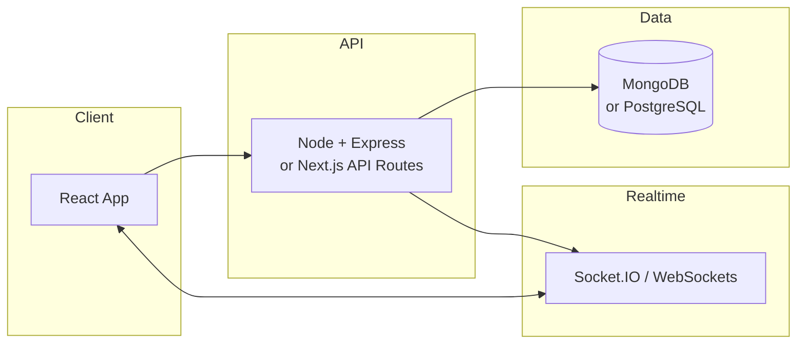

<div align="center">

# Enterprise Food Delivery Platform

### For office professionals · Full-stack build spec

**Role:** Full-Stack Developer · Scalable web apps · Modern UX

</div>

---

## Quick Navigation

| Section | Topic |
|:---|:---|
| [Context](#context-and-role) | Mission & constraints |
| [UX](#ui--ux-requirements) | React · Tailwind · Framer Motion |
| [Frontend](#frontend-architecture) | Landing, animations, discovery, ordering |
| [Checkout](#corporate-checkout--real-time-tracking) | Office logistics & tracking |
| [Features](#important-features) | Dashboard, live tracking, sockets, notifications |
| [Dashboards](#admin--restaurant-dashboard) | RBAC, partner & admin tools |
| [Backend](#backend-architecture) | APIs, security, payments, database |
| [Performance](#performance--scalability) | Peak traffic & optimization |
| [DevOps](#devops--deployment) | Docker, CI/CD, env vars |
| [Stack](#tech-stack) | Technology summary |
| [Output](#expected-output) | Deliverables & final goal |

---

## Context and Role

Build a **food delivery platform** for office employees during working hours.

| Requirement | Detail |
|:---|:---|
| **Audience** | Office employees & working professionals |
| **Peak hours** | 12:00 PM – 2:30 PM (high concurrent load) |
| **Experience** | Fast, responsive, animated, real-time, secure |

**Core capabilities**

- Restaurant browsing · Meal customization · Cart · Secure checkout
- Office delivery scheduling · Real-time order tracking
- High performance · Accessibility · Scalability

---

## UI & UX Requirements

> Premium feel powered by **React**, **Tailwind CSS**, and **Framer Motion**

| Quality | Target |
|:---|:---|
| Responsiveness | Highly responsive, mobile-first |
| Interaction | Interactive, fluid micro-interactions |
| Aesthetic | Modern, smooth, enterprise-grade |

---

## Frontend Architecture

### 1 · Landing Page

- Hero section with strong visual hierarchy
- Slider showcasing local restaurants / places
- Featured corporate lunch menus
- Social proof & reviews

### 2 · Smooth Animations

| Effect | Use case |
|:---|:---|
| Fade-in & scroll animations | Page and section reveals |
| Hover on food cards | Discovery delight |
| Skeleton loaders | Perceived performance |
| Page transitions | Route changes |
| Animated loading states | Async data |

**Library:** Framer Motion

### 3 · Easy Discovery

Restaurant browse page:

- Instant search · Debounced filtering
- Filters: cuisine · rating · delivery time

### 4 · Effortless Ordering

**Menu**

- Flying add-to-cart animation
- Category menus · Sticky side nav
- Smooth quantity updates · Promo codes

**Meal customizer modal**

- Sides · Extra toppings · Add/remove protein
- Spice level · Special instructions

---

## Corporate Checkout & Real-Time Tracking

Office delivery needs richer logistics than consumer apps.

**Checkout fields (required)**

| Field | Example |
|:---|:---|
| Office building name | `Tech Park Tower B` |
| Floor | `4` |
| Wing | `East` |
| Desk / cubicle | `4E-127` |

---

## Important Features

### User Dashboard

- Bookmark restaurants · Save office addresses
- Edit profile · Order history · Active order tracking

### Live Order Tracking

Post-checkout → live tracking page.

| Step | State |
|:---:|:---|
| 1 | Order accepted |
| 2 | In kitchen |
| 3 | On the way |
| 4 | Reaching location |
| 5 | Delivered |

**UI:** Animated stepper · Real-time updates · Live ETA

### Real-Time Infrastructure

**Socket.IO** for order, driver, and kitchen updates — no manual refresh.

### Notifications

| Channel | Tool |
|:---|:---|
| Email | Nodemailer |
| Push | Firebase Cloud Messaging (FCM) |

**Example copy**

> *"Your lunch order has been delivered to the reception of 4th floor."*

**Triggers:** Order confirmed · Payment success · Prep started · Dispatched · Delivered

---

## Admin & Restaurant Dashboard

**Access control:** Role-Based Access Control (RBAC)

### Restaurant Partner Dashboard

| Capability | |
|:---|:---|
| Real-time incoming orders | Accept / reject |
| Status updates | Menu CRUD |

### Admin Dashboard

| Capability | |
|:---|:---|
| Manage restaurants & users | Track deliveries |
| Platform analytics | Activity monitoring |

**Analytics:** Daily revenue · Top restaurants · Active users · Delivery performance · Order volume

**UI:** Graphs · Charts · Filters · Search

---

## Backend Architecture



| Layer | Options |
|:---|:---|
| **API** | Node.js + Express **or** Next.js API Routes |
| **Database** | MongoDB **or** PostgreSQL |

**API responsibilities**

- Authentication · Orders · Restaurants · Payments · Notifications · Real-time events

---

## Security & Authentication

> Non-negotiable — treat as baseline, not optional.

| Area | Implementation |
|:---|:---|
| **Auth** | JWT · Password login · bcrypt hashing |
| **Flows** | Register · Login · Logout · Forgot password |
| **Middleware** | Sanitization · XSS · SQL injection protection |
| **Hardening** | Rate limiting · Secure headers · Env protection |

**Recommended packages:** `helmet` · `express-rate-limit` · `xss-clean` · `express-mongo-sanitize` · `dotenv`

---

## Payment Integration

**Gateways:** Stripe · Razorpay · PayPal

| Feature | Required |
|:---|:---|
| Secure transactions | Yes |
| Success / failure handling | Yes |
| Webhooks | Yes |
| Receipt generation | Yes |

---

## Database Requirements

Store entities for:

`Users` · `Restaurants` · `Menu items` · `Orders` · `Payments` · `Delivery status` · `Reviews` · `Ratings`

---

## API Response Structure

**Success**

```json
{
  "success": true,
  "status": 200,
  "message": "Order fetched successfully",
  "data": {}
}
```

**Error**

```json
{
  "success": false,
  "status": 400,
  "error": {
    "code": "VALIDATION_ERROR",
    "message": "Invalid request data",
    "details": []
  }
}
```

---

## Performance & Scalability

**Peak window:** 12:00 PM – 2:30 PM · High concurrent traffic · Horizontal scaling

**Optimization checklist**

- [ ] Code splitting & lazy loading
- [ ] Image optimization & compression
- [ ] Pagination & infinite scroll
- [ ] Debounced search
- [ ] Caching strategies
- [ ] Bundle size · API latency · DB queries · CDN images

---

## Responsive Design & Accessibility

| Area | Requirement |
|:---|:---|
| Layout | Fully responsive · Mobile-first |
| SEO | Optimized metadata & structure |
| a11y | Semantic HTML · ARIA · Keyboard nav · Contrast |

---

## DevOps & Deployment

| Topic | Tooling |
|:---|:---|
| **Containers** | Docker |
| **CI/CD** | Vercel · AWS |
| **Pipeline** | Production builds · Env config · Automated deploy · Tests |

**Environment variables (never expose on frontend)**

- API keys · Database URLs · JWT secrets · Stripe secrets · Firebase credentials

---

## Tech Stack

| Layer | Technologies |
|:---|:---|
| **Frontend** | React.js · Framer Motion · Tailwind CSS · Redux or Zustand |
| **Backend** | Node.js · Express.js · JWT · Socket.IO |
| **Database** | MongoDB or PostgreSQL |
| **Payments** | Stripe · Razorpay · PayPal |
| **Notifications** | Nodemailer · Firebase Cloud Messaging |
| **Deploy** | Vercel · AWS · Docker |

---

## Expected Output

### User experience

Smooth ordering · Real-time tracking · Responsive UI · Modern animations

### Authentication

Full auth system · Secure sessions · Password recovery

### Payments

Secure checkout · Gateway integration · Receipts

### Admin

Restaurant & user management · Analytics · Delivery monitoring

### Infrastructure

Scalable backend · Real-time layer · Deployment-ready · CI/CD enabled

---

<div align="center">

## Final Goal

**Production-grade, scalable, secure, and highly interactive** corporate food delivery — optimized for office professionals and enterprise traffic.

</div>
